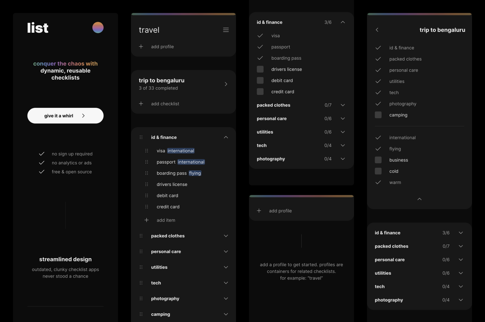

# list

&ldquo;Adaptable checklists&rdquo; are **reusable** and **easily tailored** for different situations. For instance, a
packing list for a domestic trip may include &ldquo;clothes&rdquo; and &ldquo;toiletries&rdquo; but not
&ldquo;passport&rdquo;. By pre-organizing list items with categories and tags, you can generate checklists for any
occasion in a matter of seconds.



## Development Setup

Install [Git](https://git-scm.com/book/en/v2/Getting-Started-Installing-Git), [Node](https://nodejs.org/en/download) and
[bun](https://bun.sh/docs/installation), then:

```shell
git clone git@github.com:xvvvyz/list.git
cd list
bun i
bun x replicache get-license
echo 'NEXT_PUBLIC_REPLICACHE_LICENSE_KEY=<your license key>' > .env
bun start
```

## Built With

- [Figma](https://www.figma.com) to explore UI concepts
- [TypeScript](https://www.typescriptlang.org) for strictly-typed JavaScript
- [Next.js](https://nextjs.org) + [Vercel](https://vercel.com) for production-ready [React](https://reactjs.org)
- [Replicache](https://replicache.dev) + [Supabase](https://supabase.com) for state management
- [Chakra UI](https://chakra-ui.com) for accessible UI components
- [dnd kit](https://dndkit.com) for accessible drag and drop
- [Prettier](https://prettier.io) for automatic code formatting
- [ESLint](https://eslint.org) to enforce code best practices
